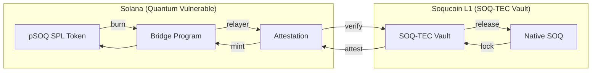

# SOQ-TEC

**Soqucoin Operations for Quantum-Tolerant Ecosystem Custody**

> *Vault-Tec saved humanity from nuclear war. SOQ-TEC saves your assets from quantum war.*

[](LICENSE)
[](https://arena.colosseum.org/hackathon)
[](https://xplorer.soqu.org)

---

## The Problem

**100% of Solana wallets are quantum-vulnerable.**

Every Ed25519 public key is exposed directly on-chain. When a cryptographically relevant quantum computer runs Shor's algorithm, every keypair is recoverable. The "harvest now, decrypt later" (HNDL) attack means adversaries are **already recording** Solana transactions for future decryption.

**$180B+ in Solana TVL** is protected by classical cryptography that has an expiration date.

### Why Solana Can't Fix It Natively

[Project Eleven](https://blog.projecteleven.com/posts/project-eleven-to-advance-post-quantum-security-for-the-solana-network) — Solana's own PQ security partner — proved this in April 2026: replacing Ed25519 with Dilithium on Solana's testnet caused a **90% throughput reduction**. Signatures went from 64 bytes to 2,420 bytes (40× larger). Solana's architecture (Gulf Stream, Turbine, QUIC) is optimized for compact data — full PQ migration would destroy what makes Solana valuable.

The [Winternitz Vault](https://github.com/blueshift-gg/solana-winternitz-vault) was the interim answer — hash-based one-time signatures. But it handles **SOL only** (no SPL tokens), keys die after one use, and it can't compose with DeFi. It's a fire exit, not a home.

---

## The Solution

**SOQ-TEC is the quantum-safe custody layer for Solana.**

Soqucoin is a purpose-built, [ML-DSA-44 (FIPS 204)](https://csrc.nist.gov/pubs/fips/204/final) Dilithium-native L1 blockchain designed from genesis for post-quantum safety. It's not fast — it's Dogecoin-speed (~1-minute blocks, UTXO model). **And that's the point.**

Think of it like a safety deposit box at a bank:
- **Solana** = the trading floor (fast, liquid, classical)
- **Soqucoin** = the vault (NIST Dilithium, Halborn-audited, quantum-safe)  
- **SOQ-TEC** = the bridge between them

Our bridge doesn't take value **from** Solana. It extends Solana's security perimeter **into** post-quantum territory.

```
Solana Wallet (Ed25519, vulnerable)
    → Winternitz Vault (hash-based PQ on Solana)
        → SOQ-TEC Bridge (relayer attestation)
            → SOQ-TEC Vault (Dilithium PQ custody on Soqucoin L1)
                → Bridge back when you need Solana speed
```

---

## Architecture

### Bridge Components

| Component | Technology | Status |
|-----------|-----------|--------|
| **Solana Bridge Program** | Anchor/Rust — SPL burn/mint, circuit breaker, PoR | Deployed (devnet) |
| **PAUL Lane Manager** | Python — Pre-Allocated UTXO Lanes for sub-second releases | Deployed |
| **DUA/CEA Pipeline** | TypeScript/Node — Dual Unicast Adapter + Chain Event Aggregator | Deployed |
| **Relayer Service** | TypeScript/Node — event watchers, PAUL routing | Deployed |
| **SOQ-TEC Terminal** | HTML/CSS/JS — Pip-Boy themed operations dashboard | Deployed |

### How It Works



### Winternitz Integration (Stretch Goal)

The Winternitz Vault becomes the first link in an **end-to-end PQ-safe chain**:

1. User deposits SOL into a Winternitz Vault (PQ-safe on Solana)
2. Vault funds a bridge transaction via SOQ-TEC
3. Bridge converts to native SOQ on Soqucoin L1 (also PQ-safe)
4. Neither side uses classical Ed25519 at any point in the critical path

This creates the world's first **fully post-quantum cross-chain flow**.

---

## SOQ-TEC Terminal

The bridge dashboard uses a Fallout Pip-Boy / Vault-Tec inspired terminal aesthetic:

- **Boot Sequence** — Full BIOS-style system initialization
- **Vault Status** — Real-time balance, backing ratio, Dilithium protection
- **Network Comparison** — Soqucoin (PQ-NATIVE) vs Solana (QUANTUM EXPOSED)
- **Bridge Activity** — Live transaction feed
- **Proof of Reserves** — Visual SOQ locked vs pSOQ minted
- **CRT Effects** — Scanlines, vignette, phosphor glow, screen flicker

**Live**: [soqtec.soqu.org](https://soqtec.soqu.org)

---

## Credibility

| Asset | Detail |
|-------|--------|
| **Live Testnet** | Soqucoin Testnet3 — [xplorer.soqu.org](https://xplorer.soqu.org) |
| **Security Audit** | Halborn — completed & fully remediated (2026) |
| **Cryptography** | NIST FIPS 204 ML-DSA-44 (Dilithium) — production, not prototype |
| **Patent** | Application #63/999,796 — PQ blockchain consensus |
| **Codebase** | 100,000+ LOC open source C++ |
| **Founder** | 25 years USAF Cyber Operations + Oracle security engineering |
| **pSOQ Token** | [Live on Solana](https://pump.fun/coin/6NX2MWBuJM2Fn63K4hUgMPivLXHV8pwsU1yTdmjKpump) — 1B supply |

---

## Business Model

| Revenue Stream | Model |
|---------------|-------|
| **Bridge fees** | 0.1% per cross-chain transfer |
| **PQ custody services** | Institutional cold storage |
| **PQCAT compliance** | PQC readiness scanning for Solana protocols |
| **SDK licensing** | Bridge tech licensed to other L1s |

**TAM**: $180B+ Solana TVL with quantum-vulnerable Ed25519 exposure.

---

## Roadmap

| Week | Focus |
|------|-------|
| **Week 1** (Apr 7–13) | Terminal dashboard, GitHub repo, Colosseum registration |
| **Week 2** (Apr 14–20) | Solana bridge program, relayer service, devnet deploy, E2E bridge proven |
| **Week 3** (Apr 21–27) | PAUL/DUA/CEA pipeline, VPS migration, sub-second releases verified |
| **Week 4** (Apr 28–May 4) | Demo recording, submission polish, final documentation |

---

## Quick Start

```bash
# Clone
git clone https://github.com/soqucoin/soqtec.git
cd soqtec

# The terminal dashboard is a static site — just open it
open index.html
# Or serve locally
python3 -m http.server 8080
```

---

## Project Structure

```
soqtec/
├── index.html          # SOQ-TEC Terminal dashboard
├── style.css           # Pip-Boy theme + CRT effects
├── script.js           # Boot sequence, live data, activity feed
├── programs/
│   └── soqtec-bridge/  # Anchor program (Solana devnet)
├── relayer/
│   └── src/            # DUA/CEA pipeline + PAUL routing
├── scripts/
│   └── e2e-dua-burn-test.js  # End-to-end pipeline test
├── docs/
│   ├── ARCHITECTURE.md       # Technical architecture
│   ├── SECURITY.md           # Trust model & threat assumptions
│   ├── BRIDGE_SPEC.md        # Bridge protocol specification
│   └── PAUL_ARCHITECTURE.md  # PAUL/DUA/CEA architecture
├── LICENSE             # MIT
└── README.md           # This file
```

---

## Links

- **Dashboard**: [soqtec.soqu.org](https://soqtec.soqu.org)
- **Explorer**: [xplorer.soqu.org](https://xplorer.soqu.org)
- **Soqucoin**: [soqu.org](https://soqu.org)
- **Labs**: [soqucoin.com](https://soqucoin.com)
- **pSOQ Token**: [pump.fun](https://pump.fun/coin/6NX2MWBuJM2Fn63K4hUgMPivLXHV8pwsU1yTdmjKpump)
- **Twitter**: [@soqucoin](https://x.com/soqucoin)

---

## Hackathon

**Colosseum Frontier 2026** — April 6 – May 11, 2026

$2.75M in prizes. SOQ-TEC competes as the first quantum-tolerant custody bridge for Solana.

> *"Prepared for the Quantum Future."*

---

## License

MIT — see [LICENSE](LICENSE) for details.

---

<p align="center">
  <strong>SOQ-TEC</strong> — Built by <a href="https://soqucoin.com">Soqucoin Labs Inc.</a><br>
  228 Park Ave S, Pmb 85451, New York, NY 10003
</p>
