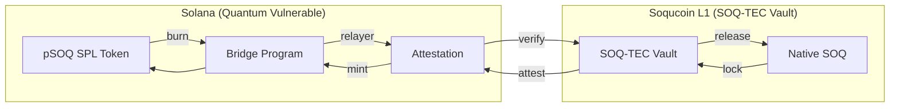

# SOQ-TEC

> SOQ-TEC is post-quantum custody and cross-chain settlement software for regulated custodians, exchanges and
> issuers, who operate it under their own licences. Soqucoin Labs builds and licenses the software. It does
> not hold user funds or keys and does not operate custody, bridging, conversion or redemption services for
> the public. Everything below was demonstrated on Solana devnet and Soqucoin stagenet with test tokens during
> the Colosseum Frontier 2026 hackathon (April to May 2026). There is no live deployment. pSOQ is a token on
> Solana. The path from pSOQ to SOQ is in legal review and details will be published when it is complete.

**Soqucoin Operations for Quantum-Tolerant Ecosystem Custody**

> *Post-quantum custody software for the assets a licensed custodian holds.*

[](LICENSE)
[](https://arena.colosseum.org/hackathon)
[](https://xplorer.soqu.org)

---

## The Problem

**100% of Solana wallets are quantum-vulnerable.**

Every Ed25519 public key is exposed directly on-chain. When a cryptographically relevant quantum computer runs Shor's algorithm, every keypair is recoverable. The "harvest now, decrypt later" (HNDL) attack means adversaries are **already recording** Solana transactions for future decryption.

**$180B+ in Solana TVL** is protected by classical cryptography that has an expiration date.

### Why Solana Can't Fix It Natively

[Project Eleven](https://blog.projecteleven.com/posts/project-eleven-to-advance-post-quantum-security-for-the-solana-network) — Solana's own PQ security partner — proved this in April 2026: replacing Ed25519 with Dilithium on Solana's testnet caused a **90% throughput reduction**. Signatures went from 64 bytes to 2,420 bytes (40× larger). Solana's architecture (Gulf Stream, Turbine, QUIC) is optimized for compact data — full PQ migration would destroy what makes Solana valuable.

The [Winternitz Vault](https://github.com/blueshift-gg/solana-winternitz-vault) was the interim answer — hash-based one-time signatures. But it handles **SOL only** (no SPL tokens), keys die after one use, and it can't compose with DeFi. It's a fire exit, not a home.

---

## The Solution

**SOQ-TEC is post-quantum custody and settlement software that a licensed custodian can deploy for Solana assets.**

Soqucoin is a purpose-built, [ML-DSA-44 (FIPS 204)](https://csrc.nist.gov/pubs/fips/204/final) Dilithium-native L1 blockchain designed from genesis for post-quantum safety. It's not fast — it's Dogecoin-speed (~1-minute blocks, UTXO model). **And that's the point.**

The three parts:
- **Solana** is the trading floor (fast, liquid, classical signatures)
- **Soqucoin** is the post-quantum settlement layer (ML-DSA-44; the L1 was audited by Halborn)
- **SOQ-TEC** is the software that moves value between the two chains when a licensed operator runs it

The software does not take value from Solana. It gives a custodian a post-quantum place to hold Solana-side value.

Flow the software implements. Custody sits with the operator's vault keys.

```
Solana Wallet (Ed25519, vulnerable)
    → Winternitz Vault (hash-based PQ on Solana)
        → SOQ-TEC Bridge (relayer attestation)
            → Operator's vault (ML-DSA-44 keys on Soqucoin L1)
                → Return path to Solana (operator's program mints the Solana-side token)
```

---

## Architecture

### Bridge Components

| Component | Technology | Demonstration status (2026 hackathon) |
|-----------|-----------|--------|
| **Solana Bridge Program** | Anchor/Rust — SPL burn/mint, circuit breaker, PoR | Ran on Solana devnet, April to May 2026 |
| **XMSS Vault Program** | Anchor/Rust — WOTS+ signature verification, Merkle proof, CPI burn | Ran on Solana devnet, April to May 2026 |
| **DUA/CEA Pipeline** | TypeScript/Node — Dual Unicast Adapter + Chain Event Aggregator | Ran on devnet and stagenet, April to May 2026 |
| **Relayer Service** | TypeScript/Node — event watchers, persistent seen-set, signer routing | Ran on devnet and stagenet, April to May 2026 |
| **SoquShield Bridge** | Dart/Flutter — native WOTS+ signer, vault TX builder | Dart port, cross-verified against the JS reference |
| **SOQ-TEC Terminal** | HTML/CSS/JS — retro terminal dashboard | Demonstration dashboard, test data |
| ~~PAUL Lane Manager~~ | ~~Python — Pre-Allocated UTXO Lanes~~ | 🔴 Retired (May 2026) |

### How It Works


```mermaid
flowchart LR
    subgraph Solana["Solana (Quantum Vulnerable)"]
        A[pSOQ SPL Token] -->|burn| B[Bridge Program]
        B -->|relayer| C[Attestation]
    end
    subgraph Soqucoin["Soqucoin L1 (SOQ-TEC Vault)"]
        C -->|verify| D[SOQ-TEC Vault]
        D -->|release| E[Native SOQ]
    end
    E -->|lock| D
    D -->|attest| C
    C -->|mint| B
    B --> A
```

### XMSS Vault Integration (Patent Claims 1+4+11)

The XMSS vault is the primary path — an **end-to-end quantum-safe chain** where Ed25519 is used ONLY for Solana transaction fees, never for value custody:

1. User generates an XMSS-Lite key tree (Keccak256 WOTS+, w=16)
2. Vault program verifies WOTS+ signature + Merkle proof on-chain
3. Vault CPI-calls `burn_for_redemption` on the bridge program
4. Relayer detects the burn event (identical to native burns)
5. The operator's ML-DSA-44 signer releases SOQ on L1

**Value custody chain:** `WOTS+ (Keccak) → ML-DSA-44 (Dilithium)` — zero classical touch.

### SoquShield Mobile Bridge

SoquShield (Flutter iOS/Android) includes a complete Dart port of the XMSS-Lite signing engine:
- `wots_signer.dart` — WOTS+ sign/verify, hash chains
- `xmss_tree.dart` — key tree + Merkle proof generator  
- `vault_bridge_service.dart` — Solana TX builder with PDA derivation, Borsh encoding
- Cross-verified bit-for-bit against the JavaScript implementation (9/9 vectors match)

---

## SOQ-TEC Terminal

The terminal is a demonstration dashboard that showed test-network data during the hackathon. It uses a retro CRT terminal aesthetic:

- **Boot Sequence** — BIOS-style system initialization
- **Vault Status** — Vault balance and backing ratio panels (test data)
- **Network Comparison** — Soqucoin (PQ-NATIVE) vs Solana (QUANTUM EXPOSED)
- **Bridge Activity** — Transaction feed (test data)
- **Proof of Reserves** — SOQ locked vs pSOQ minted panel (test data)
- **CRT Effects** — Scanlines, vignette, phosphor glow, screen flicker

---

## Credibility

| Asset | Detail |
|-------|--------|
| **Live Testnet** | Soqucoin Testnet3 — [xplorer.soqu.org](https://xplorer.soqu.org) |
| **Security Audit** | Halborn audited the Soqucoin L1 (2026). The bridge program and relayer are unaudited. |
| **Cryptography** | NIST FIPS 204 ML-DSA-44 (Dilithium) — production, not prototype |
| **Patent** | Application #63/999,796 — PQ blockchain consensus |
| **Codebase** | 100,000+ LOC open source C++ |
| **Founder** | 25 years USAF Cyber Operations + Oracle security engineering |
| **pSOQ Token** | pSOQ is a token on Solana. The path from pSOQ to SOQ is in legal review and details will be published when it is complete. |

---

## Business Model

| Revenue Stream | Model |
|---------------|-------|
| **Technology licensing** | SOQ-TEC custody and settlement software licensed to custodians, exchanges and issuers who operate it under their own licences |
| **PQCAT compliance** | PQC readiness scanning for Solana protocols |
| **SDK licensing** | Bridge technology licensed to other L1s |

**TAM**: $180B+ Solana TVL with quantum-vulnerable Ed25519 exposure.

---

## Roadmap

Hackathon build log, April 2026. Test networks only.

| Week | Focus |
|------|-------|
| **Week 1** (Apr 7–13) | Terminal dashboard, GitHub repo, Colosseum registration |
| **Week 2** (Apr 14–20) | Solana bridge program, relayer service, devnet deploy, E2E bridge proven |
| **Week 3** (Apr 21–27) | PAUL/DUA/CEA pipeline, VPS migration, sub-second releases verified |
| **Week 4** (Apr 28–May 4) | Demo recording, submission polish, final documentation |

---

## Quick Start

```bash
# Clone
git clone https://github.com/soqucoin/soqtec.git
cd soqtec

# The terminal dashboard is a static site — just open it
open index.html
# Or serve locally
python3 -m http.server 8080
```

---

## Project Structure

```
soqtec/
├── index.html          # SOQ-TEC Terminal dashboard
├── style.css           # Pip-Boy theme + CRT effects
├── script.js           # Boot sequence, live data, activity feed
├── programs/
│   ├── soqtec-bridge/  # Anchor program — SPL burn/mint bridge
│   └── xmss-vault/     # Anchor program — WOTS+ vault + CPI burn
├── relayer/
│   └── src/            # DUA/CEA pipeline + soq-signer routing
├── scripts/
│   ├── xmss-client.js        # XMSS-Lite JS reference implementation
│   ├── e2e-vault-bridge-test.js  # Vault CPI E2E test (gold standard)
│   ├── e2e-dua-burn-test.js     # DUA pipeline test
│   └── cross-verify-wots.js     # Cross-verification test vectors
├── docs/
│   ├── ARCHITECTURE.md       # Technical architecture
│   ├── SECURITY.md           # Trust model & threat assumptions
│   ├── BRIDGE_SPEC.md        # Bridge protocol specification
│   └── PAUL_ARCHITECTURE.md  # PAUL/DUA/CEA architecture (⚠️ PAUL retired)
├── LICENSE             # MIT
└── README.md           # This file
```

---

## Links

- **Demonstration dashboard (test networks)**: [soqtec.soqu.org](https://soqtec.soqu.org)
- **Explorer**: [xplorer.soqu.org](https://xplorer.soqu.org)
- **Soqucoin**: [soqu.org](https://soqu.org)
- **Labs**: [soqucoin.com](https://soqucoin.com)
- **Twitter**: [@soqucoin](https://x.com/soqucoin)

---

## Hackathon

**Colosseum Frontier 2026** — April 6 – May 11, 2026

SOQ-TEC was entered in Colosseum Frontier 2026 as post-quantum custody software for Solana assets.

> *"Prepared for the Quantum Future."*

---

## License

MIT — see [LICENSE](LICENSE) for details.

---

<p align="center">
  <strong>SOQ-TEC</strong> — Built by <a href="https://soqucoin.com">Soqucoin Labs Inc.</a><br>
  228 Park Ave S, Pmb 85451, New York, NY 10003
</p>
